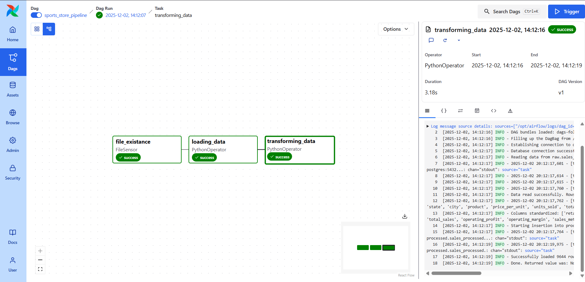

# Sports Store Sales Analysis Pipeline

## Project Overview
This project implements a robust **ELT (Extract, Load, Transform)** pipeline to analyze sales data from a sports retailer. Orchestrated by **Apache Airflow** and containerized with **Docker**, the pipeline ingests raw Excel data into a **PostgreSQL** data warehouse, transforms it for analysis, and visualizes the results using **Power BI**. However, as analysis is not the main focus of this project, the Power BI dashboard is simple and serves to demonstrate the end-to-end functionality of the pipeline.

## Dataset Selection
The dataset used is the **Sport Products Sales Analysis Challenge** from FP20 Analytics Challenges Group, a LinkedIn community focused on data analytics projects. You can find more about them [here](https://fp20analytics.com/).

After surfing through all the datasets they have shared, I selected this one because it offers a rich set of dimensions, including Time (Invoice Date), Geography (Region, State, City), Product Hierarchy (Product), and Business Entities (Retailer, Sales Method), making it perfect for analysis. Additionally, the dataset presents real-world data quality challenges, like handling typos and standardizing column names, making it great for practicing transformation logic.

## Architecture: Why ELT?
An **ELT (Extract, Load, Transform)** approach was chosen over traditional ETL for this project.

### The Rationale
1.  **Raw Data Preservation**: By loading the data directly into a `raw` schema first, we create an immutable audit trail. If business logic changes, we can re-run transformations without needing to access the original source files again.
2.  **Scalability**: Separating the "Load" and "Transform" phases allows us to scale them independently. The loading process focuses solely on I/O efficiency, while the transformation process focuses on compute and logic.
3.  **Agility**: New questions often require new transformations. With the data already sitting in the warehouse (Postgres), data analysts and engineers can prototype and deploy new transformation logic much faster.
4.  **Schema Evolution**: The `raw` layer can accept data with minimal validation, preventing pipeline failures due to minor schema drifts in the source system. Strict schema enforcement is applied during the transformation step to the `processed` layer.

## Airflow DAG



## Dashboard
Here, you can see the dashboard, it was created using Power BI.


This dashboard shows the sales data of a sports retailer. There are 4 metrics displayed and 3 charts.

The metrics are:

- **Orders**: The total number of orders.
- **Revenue**: The total revenue.
- **AVG Units Sold**: The average number of units sold.
- **Best Sales Method**: The sales method with the highest total orders.

The charts are: 

- **Revenue by Month and Year**: Shows how the revenue has changed over time.
- **Sales by Region**: Shows the breakdown of sales by region.
- **Top 5 products by Sales**: Shows the 5 products with the highest sales.


## Project Structure
```bash
├── dags/
│   ├── data/
│   │   └── raw/              # Drop your source Excel file here
│   ├── src/
│   │   ├── load_task.py      # Extracts Excel -> Loads to Postgres (raw schema)
│   │   ├── transformation_task.py # Reads raw -> Cleans/Types -> Loads to Postgres (processed schema)
│   │   └── logger.py         # Custom logging configuration
│   └── dag.py                # Airflow DAG definition
├── docker/                   # Dockerfile for Airflow
├── init-scripts/             # SQL scripts to initialize DB schemas and roles
├── docker-compose.yaml       # Orchestration of Airflow and Postgres services
└── requirements.txt          # Python dependencies
```


## How to Reproduce

### Prerequisites
*   **Docker** and **Docker Compose** installed on your machine.

### Step-by-Step Guide

1.  **Clone the Repository**
    ```bash
    git clone <repository-url>
    cd etl_pipeline
    ```

2.  **Prepare the Data**
    *   Place the file `sport_products_sales_analysis_challenge_raw.xlsx` inside the `dags/data/raw/` directory.
    *   *Note: The pipeline includes a FileSensor that waits for this file to appear.*

3.  **Start the Services**
    Run the following command to build the images and start Airflow and PostgreSQL:
    ```bash
    docker compose up -d
    ```

4.  **Access the Airflow UI**
    *   Open your browser and go to `http://localhost:8080`.
    *   **Username**: `airflow`
    *   **Password**: `airflow`

5.  **Trigger the Pipeline**
    *   Locate the DAG named `sports_store_pipeline`.
    *   Toggle the switch to **Unpause** the DAG.
    *   Click the "Trigger DAG" button.

6.  **Verify the Data**
    You can connect to the PostgreSQL database to verify the results:
    *   **Host**: `localhost`
    *   **Port**: `5432`
    *   **Database**: `sports_store`
    *   **User**: `data_analyst`
    *   **Password**: `analyst123`

    Check the tables:
    *   `raw.sales_raw`: The raw data as loaded from Excel.
    *   `processed.sales_processed`: The cleaned data.


## Technologies Used
*   **Apache Airflow**: Workflow orchestration and scheduling.
*   **Docker**: Containerization for consistent environments.
*   **PostgreSQL**: Relational database for data warehousing.
*   **Python (Pandas & SQLAlchemy)**: Data manipulation and database interaction.
*   **Power BI**: Data visualization and dashboard creation. 


